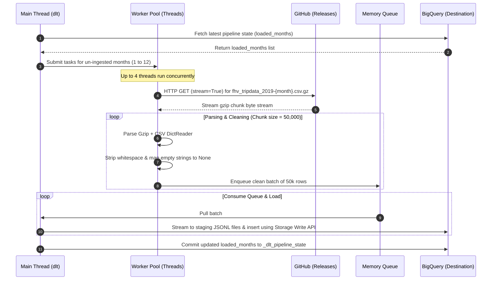

# NYC FHV 2019 dlt Ingestion Pipeline

[](https://dlthub.com)
[](https://python.org)
[](https://cloud.google.com/bigquery)

This repository contains a production-grade, highly resilient, and memory-safe data ingestion pipeline that extracts 2019 NYC Taxi & Limousine Commission (TLC) For-Hire Vehicle (FHV) trip data from raw GitHub release sources and loads it directly into Google BigQuery using the `dlt` (data load tool) framework.

---

## Table of Contents

1. [System Architecture & Data Flow](#1-system-architecture--data-flow)
2. [Production Resiliency Features](#2-production-resiliency-features)
3. [BigQuery Schema & Optimizations](#3-bigquery-schema--optimizations)
4. [Local WSL/Linux Setup](#4-local-wsllinux-setup)
5. [GCP Service Account & Security Configuration](#5-gcp-service-account--security-configuration)
6. [Running & Monitoring](#6-running--monitoring)

---

## 1. System Architecture & Data Flow

The pipeline uses a multi-threaded producer-consumer architecture to extract compressed CSV datasets in parallel, clean them on-the-fly, stream them in memory-safe chunks, and batch-load them to Google BigQuery.

### Architectural Layout



---

## 2. Production Resiliency Features

### A. Idempotency & State Management
To prevent loading duplicate records if the pipeline is run multiple times, the pipeline uses `dlt`'s native resource state.
* Completed months are tracked in a state list (`loaded_months`).
* This state is persisted in BigQuery within the `_dlt_pipeline_state` table.
* On execution, the pipeline retrieves the state, checks if a month is already marked as loaded, and automatically skips it.

### B. Network Resiliency & HTTP Retries
The pipeline implements a robust HTTP session adapter utilizing `requests.Session` and `urllib3.util.Retry`:
* **Max Retries**: 5 connection, read, and status retries.
* **Exponential Backoff**: Backoff factor of `1.5` to throttle requests during rate limits.
* **Resilient Status Codes**: Automatically retries on codes: `429` (Too Many Requests), `500` (Internal Server Error), `502` (Bad Gateway), `503` (Service Unavailable), and `504` (Gateway Timeout).
* **Timeouts**: Fixed request timeout of `60 seconds` to prevent hanging sockets.

### C. Memory-Safe Ingestion (Streaming Generators)
* File data is processed using Python generators. Instead of loading the entire `csv.gz` dataset (approx. 1.7M rows per month) into memory, the script downloads and decompresses the stream on-the-fly.
* Rows are read sequentially using `csv.DictReader` and grouped into chunks of `50,000` rows.
* This keeps the memory heap footprint below **150 MB**, allowing execution in resource-constrained container environments.

### D. Data Cleaning & Schema Evolution
* **Whitespace & NULL Handling**: The pipeline strips leading/trailing whitespace from CSV keys and values. Empty strings (`""`) are explicitly coerced to `None` to prevent type-casting errors in `dlt` and ensure they load as true database `NULL` values.
* **Schema Drift**: In July 2019, a schema change occurs where the column `affiliated_base_number` is introduced. `dlt` handles this automatically via schema evolution (runs an `ALTER TABLE` to add the column in BigQuery mid-run, with previous records populated as `NULL`).

---

## 3. BigQuery Schema & Optimizations

### Schema Configuration
The destination table is loaded under the dataset **`fhv_2019`** (located in the **`europe-west2`** region). The columns mapped to the BigQuery destination table `fhv_trips` are:

| Column Name | CSV Key | Target Data Type | Partition / Cluster |
|---|---|---|---|
| `pickup_datetime` | `pickup_datetime` | `TIMESTAMP` | **Partition Key (Day)** |
| `drop_off_datetime`| `drop_off_datetime`| `TIMESTAMP` | - |
| `dispatching_base_num` | `dispatching_base_num` | `TEXT` | **Clustering Key (1)** |
| `p_ulocation_id` | `PULocationID` | `BIGINT` | **Clustering Key (2)** |
| `d_olocation_id` | `DOLocationID` | `BIGINT` | - |
| `sr_flag` | `SR_Flag` | `TEXT` | - |
| `affiliated_base_number` | `Affiliated_base_number` | `TEXT` | Introduced Mid-2019 |

### Optimization Details
* **Partitioning**: Partitioned by `DAY` on `pickup_datetime`. This optimizes query scan costs when filtering on date ranges.
* **Clustering**: Clustered by `dispatching_base_num` and `p_ulocation_id` using the `bigquery_adapter`. This accelerates analytical query scans that filter or group by dispatching base numbers or location zones.
* **High-Throughput Storage Write API**: By installing `google-cloud-bigquery-storage`, the pipeline avoids slow HTTP multipart uploads and utilizes the Google Cloud Storage Write API, speeding up loads significantly.

---

## 4. Local WSL/Linux Setup

To run this pipeline locally in a WSL or native Linux environment, follow these steps:

### 1. Create a Python Virtual Environment
Initialize and activate a virtual environment to isolate project dependencies:
```bash
# Create the environment
python3 -m venv .venv

# Activate it
source .venv/bin/activate
```

### 2. Install Dependencies
Install the required packages. This will install `dlt`, the BigQuery dependencies, and the `google-cloud-bigquery-storage` client:
```bash
pip install -r requirements.txt
```

---

## 5. GCP Service Account & Security Configuration

The pipeline requires a GCP service account JSON key with appropriate BigQuery permissions to write datasets and tables.

### Required IAM Roles
Ensure the service account running the pipeline has the following roles:
* **`BigQuery Job User`** (Project Level) - Allow launching query and load jobs.
* **`BigQuery Data Editor`** (Dataset/Project Level) - Allow creating datasets, tables, and writing data.

### Credentials Setup
1. Download the Service Account JSON key from GCP Console.
2. Save the key file locally on your system. By default, the pipeline searches for the credentials at:
   `/home/penny_dev/.gcp/gcp-key.json`
3. Update the `GCP_KEY_PATH` constant in `dlt_bigquery_pipeline.py` if your key is stored in a different path.

> [!WARNING]
> Never commit your service account JSON file to the git repository. The `.gitignore` file is configured to exclude `gcp-key.json`, `.gcp/` directories, and all `*.json` configuration files to prevent credential leakage.

---

## 6. Running & Monitoring

Once your virtual environment is active and GCP credentials are set up, run the pipeline with:

```bash
python dlt_bigquery_pipeline.py
```

### Monitoring the Ingestion
The pipeline uses structured logging and outputs run information directly to standard output:
* Logging starts with credential validation and pipeline boot details.
* The script prints the number of rows extracted, normalizer progress, and load steps.
* Once the run completes, a summary representation (`Load Info`) is printed showing:
  * Dataset target region details.
  * Load execution times.
  * Loaded schema version and hash information.
